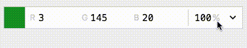

**Colors** is a field for [Kirby 3](https://getkirby.com) that allows the selection of a color using the native color selector. Colors can be viewed and edited in either HEX, RGB or HSL. Additionally, the field automatically calculates the most readable contrast color. This can be useful, if you'd like to specify background colors and would like to adjust the text colors accordingly. The field displays the color contrast ratings AA, AALarge, AAA and AAALarge according to WCAG accessibility guidelines.

## Installation

### Download

Download and copy this repository to `/site/plugins/colors`.

### Git submodule

```
git submodule add https://github.com/hananils/kirby-colors.git site/plugins/colors
```

### Composer

```
composer require hananils/kirby-colors
```

## Blueprint

This field is provided under the type `colors`:

-   `alpha`: allows you to enable or disable the opacity widget, either `true` or `false`.
-   `contrast`: allows you to enable or disable the contrast widget that calculated the most readable contrast color, either `true` or `false` or an array of colors the plugin should choose from.
-   `default`: the color to be used as default, either in hex3, hex6, hex8, rgb, rgba, hsl or hsla.

### Dynamic contrast options

In order to set contrast colors, it possible to query another field:

```yml
colors:
    type: colors
    label: Colors
    contrast:
        type: query
        query: site.contrasts
```

You will have to make sure that the references field returns either a single color or an array of colors. Use methods like `split` to handle comma-separated strings, e. g. `site.contrasts.split`.

If you'd like to reference a field on the same page as your colors field, you'll have to watch for changes in order to get live updates:

```yml
colors:
    type: colors
    label: Colors
    contrast:
        type: watch
        field: contrasts
contrasts:
    type: text
    label: Contrast colors
```

If you need to split values of the watched field, you have to define the split character as well:

```yml
colors:
    type: colors
    label: Colors
    contrast:
        type: watch
        field: contrasts
        split: ','
contrasts:
    type: text
    label: Contrast colors
```

### Examples


```yml
colors:
    type: colors
    label: Colors
```


```yml
colors:
    type: colors
    label: Colors (alpha)
    alpha: true
```


```yml
colors:
    type: colors
    label: Colors (alpha + readable)
    alpha: true
    contrast: true
```


```yml
colors:
    type: colors
    label: Colors (readable)
    contrast:
        - '#112233'
        - '#778899'
```

## Field Methods

#### `$field->isHex()`

Verifies if the current color is stored as hexadecimal value, returns `true` or `false`.

#### `$field->isRgb()`

Verifies if the current color is stored as RGB value, returns `true` or `false`.

#### `$field->isHsl()`

Verifies if the current color is stored as HSL value, returns `true` or `false`.

#### `$field->toClass()`

Returns the current color object, `Hananils\Color`, see `lib\Color.php`.

#### `$field->toColor($space)`

Returns the current color as string. Accepts an optional `$space` attribute to set the output color space, either `hex`, `rgb` or `hsl`.

#### `$field->toSpace()`

Returns the current color space, either `hex`, `rgb` or `hsl`.

#### `$field->toValues()`

Returns all color values, e. g.:

```php
[
    'original' => '#ffffff',
    'space' => 'hex',
    'r' => 255,
    'g' => 255,
    'b' => 255,
    'h' => 0,
    's' => 0,
    'l' => 100,
    'a' => 100
];
```

#### `$field->toReadabilityReport()`

Returns a readability report for the contrast colors defined in the blueprint, defaults to black and white:

```php
Array
(
    [color] => Hananils\Color Object
        (
            [original:Hananils\Color:private] => #00b7ff
            [space:Hananils\Color:private] => hex
            [r:Hananils\Color:private] => 0
            [g:Hananils\Color:private] => 183
            [b:Hananils\Color:private] => 255
            [h:Hananils\Color:private] => 197
            [s:Hananils\Color:private] => 100
            [l:Hananils\Color:private] => 50
            [a:Hananils\Color:private] => 100
        )

    [combinations] => Array
        (
            [0] => Array
                (
                    [color] => Hananils\Color Object
                        (
                            [original:Hananils\Color:private] => #fff
                            [space:Hananils\Color:private] => hex
                            [r:Hananils\Color:private] => 255
                            [g:Hananils\Color:private] => 255
                            [b:Hananils\Color:private] => 255
                            [h:Hananils\Color:private] => 0
                            [s:Hananils\Color:private] => 0
                            [l:Hananils\Color:private] => 100
                            [a:Hananils\Color:private] => 100
                        )

                    [contrast] => 2.2783010917435
                    [accessibility] => Array
                        (
                        )

                )

            [1] => Array
                (
                    [color] => Hananils\Color Object
                        (
                            [original:Hananils\Color:private] => #000
                            [space:Hananils\Color:private] => hex
                            [r:Hananils\Color:private] => 0
                            [g:Hananils\Color:private] => 0
                            [b:Hananils\Color:private] => 0
                            [h:Hananils\Color:private] => 0
                            [s:Hananils\Color:private] => 0
                            [l:Hananils\Color:private] => 0
                            [a:Hananils\Color:private] => 100
                        )

                    [contrast] => 9.2173945209011
                    [accessibility] => Array
                        (
                            [0] => aaLarge
                            [1] => aaaLarge
                            [2] => aa
                            [3] => aaa
                        )

                )

        )

)
```

#### `$field->toMostReadable()`

Returns the most readable color for the contrast colors defined in the blueprint, defaults to black and white.

## Color calculation

This plugin bundles two classes, one for JavaScript and one for PHP, with the identical API to perform color calculations. See `lib/Color.php` and `src/lib/color.js`.

## Tips and tricks

1. Click on the left color preview to open the color picker.
2. Click the arrow icon to switch between color spaces.
3. When editing RGB or HSL colors, use the up and down arrow keys to adjust the value by +1 or -1.
4. Hold the [meta key](https://developer.mozilla.org/en-US/docs/Web/API/MouseEvent/metaKey) (or the shift key) to adjust values by +10 or -10.
5. Click on the grey unit indicator of a value then drag the mouse vertically to adjust the values on the fly.
   

## Alternatives

Please note that there is another color field for Kirby 3 developed by Tim Ötting called Kirby Color, see <https://github.com/TimOetting/kirby-color>.

# License

This plugin is provided freely under the [MIT license](LICENSE.md) by [hana+nils · Büro für Gestaltung](https://hananils.de).
We create visual designs for digital and analog media.
